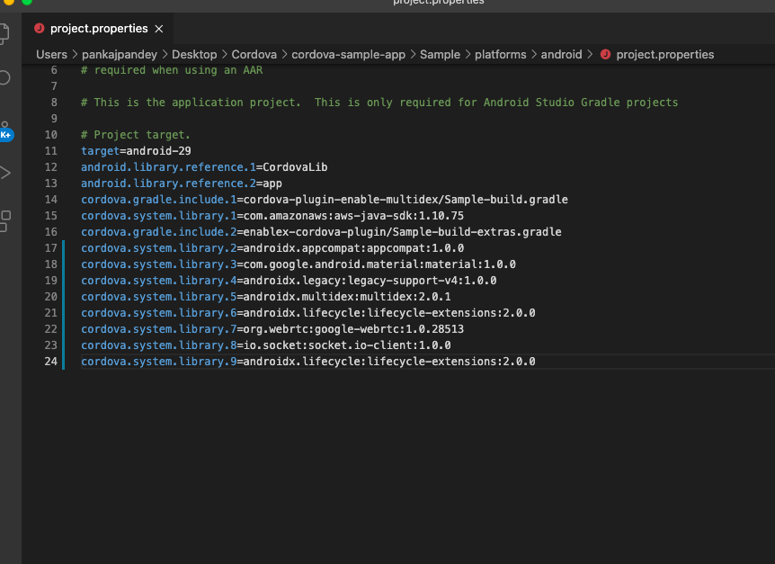

# 1-to-1 RTC: A Sample ionic App with EnableX Cordova Toolkit

This is a Sample ionic App demonstrates the use of [EnableX platform Server APIs](https://www.enablex.io/developer/video-api/server-api) and Cordova Toolkit.  It allows developers to ramp up on app development by hosting on their own devices. 

This App creates a virtual Room on the fly  hosted on the Enablex platform using REST calls and uses the Room credentials (i.e. Room Id) to connect to the virtual Room as a mobile client.  The same Room credentials can be shared with others to join the same virtual Room to carry out an RTC (Real-Time Communication) session. 

> EnableX Developer Center: https://developer.enablex.io/

## 1. How to get started

### 1.1 Prerequisites

#### 1.1.1 App Id and App Key 

* Create an account with EnableX [https://portal.enablex.io/cpaas/trial-sign-up/] 
* Create your Application
* Get your App ID and App Key delivered to your email


#### 1.1.2 Sample ionic Application 

* [Clone or download this Repository](https://github.com/EnableX/One-to-One-Video-Chat-Sample-Application-in-IONIC-Framework) 

#### 1.1.3 Test Application Server

You need to set up an Application Server to provision Web Service API for your ionic Application to enable Video Session. 

To help you to try our ionic Application quickly, without having to set up Application Server, this Application is shipped pre-configured to work in a "try" mode with EnableX hosted Application Server i.e. https://demo.enablex.io. 

Our Application Server restricts a single Session Duations to 10 minutes, and allows 1 moderator and not more than 3 participants in a Session.

Once you tried EnableX ionic Sample Application, you may need to set up your own  Application Server and verify your Application to work with your Application Server.  Refer to point 2 for more details on this.


#### 1.1.4 Configure Cordova Sample Client 

* Open the ionic sample App
* Go to home.page.ts and change the following:
    ``` 
    /* To try the app with Enablex hosted service you need to set the kTry = true */
        var kTry      = true;
    /*Your webservice host URL, Keet the defined host when kTry = true */
          var kBasedURL = "https://demo.enablex.io/";
    /*The following information required, Only when kTry = true, When you hosted your own webservice remove these fileds*/
    
    /*Use enablec portal to create your app and get these following credentials*/
          var kAppId    = "App_ID";
          var kAppkey   = "App_key";

    ``

 Note: The distributable comes with demo username and password for the Service.

#### 1.1.5 To install the EnableX Cordova plugin

* Run the following command in the root of your project:
    
    `ionic cordova plugin add enablex-cordova-plugin@latest`

#### 1.1.6 How to setup cordova plugin Android/IOS

### Android
    
After adding Cordova Enablex plugin
### Step 1. 
    Go to platfrom inside Cordova project and open Android folder

    If Android platform already added, remove Android and add again using the below command: 
    ionic cordova platform rm android && ionic cordova platform add android`
    
### Step 2. 
    Set the Minimum SDK version and desugaring in gradle.properties file as shown:

 

    android.useAndroidX=true 
    android.enableJetifier=true 
    cdvMinSdkVersion=21 
    android.enableDexingArtifactTransform.desugaring=false 
    
### Step 3. 

    Add the required libraries like webrtc and socket in the project. properties file as shown below:
    
 
    
    cordova.system.library.7=org.webrtc:google-webrtc:1.0.32006 
    cordova.system.library.8=io.socket:socket.io-client:1.0.0 
    
### Step 4. 

    If you face “merge debug resource failed” error, then add packagingOptions in app level build.gradle file in android block 
    
    Execution failed for task ':app:mergeDebugJavaResource'. 
        > A failure occurred while executing com.android.build.gradle.internal.tasks.Workers$ActionFacade 
       > More than one file was found with OS independent path 'META-INF/DEPENDENCIES'.

 
       packagingOptions { 
               exclude 'META-INF/DEPENDENCIES' 
               exclude 'META-INF/LICENSE' 
               exclude 'META-INF/LICENSE.txt' 
               exclude 'META-INF/license.txt' 
               exclude 'META-INF/NOTICE' 
               exclude 'META-INF/NOTICE.txt' 
               exclude 'META-INF/notice.txt' 
               exclude 'META-INF/ASL2.0' 
               exclude("META-INF/*.kotlin_module")  
             } 

### IOS
    
        After adding Cordova Enablex plugin please add ios project as below command
        
        ionic cordova platform add ios
        
        It will install all dependency enableX library through Pod. After that go to your iOS project folder and open your xcode , setup your certificate and then build the app either command line or through xcode. 
    
    
#### 1.1.7 To remove Enalex Cordova plugin

* Run the the following command in the root of your project:

    `ionic cordova plugin remove enablex-cordova-plugin`

### 1.2 Walkthrough Cordova Sample Application 

#### 1.2.1 Prerequisites:

Make sure You have Cordova 3.5.0 or greater installed. If you haven't, take a look at the [Cordova instructions](http://cordova.apache.org/docs/en/3.5.0/guide_cli_index.md.html) Page.

1. Install [node.js](https://nodejs.org/)

2. Install ionic: `npm install -g @ionic/cli`
3. Create a project - ` ionic start ProjectName blank `

3. Install and update [Xcode](https://developer.apple.com/xcode/) (you will need a Mac)

4. Install and update [Android Studio](https://developer.android.com/studio/index.html)

#### 1.2.2 Run The Application:

##### Note: Please make sure to run the commands in the same order as below

1. Clone this repo

2. In your terminal, change your directory to the root of the sample project you want to run.

3. Run the command:

        npm install
    to install required node modules

4. Run the command:

       ionic cordova platform add ios    //to add iOS your project
       ionic cordova platform add android // to add android project


5. Run the command to enable multidex.
    ```
    ionic cordova plugin add cordova-plugin-enable-multidex 
    ```

6. Run the command
    ```
    ionic cordova run ios  // to run iOS project
    ionic cordova run android // to run Android project
    ```

### 1.3 Test

#### 1.3.1 Open the App

* Open the App in your Device. You get a form to enter Credentials i.e. Name & Room Id.
* You need to create a Room by clicking the "Create Room" button.
* Once the Room Id is created, you can use it and share with others to connect to the Virtual Room to carry out an RTC Session either as a Moderator or a Participant (Choose applicable Role in the Form).

Note: Only one user with Moderator Role allowed to connect to a Virtual Room while trying with EnableX Hosted Service. Your Own Application Server can allow upto 5 Moderators.

Note:- In case of emulator/simulator your local stream will not create. It will create only on real device.

## 2. Set up Your Own Application Server

You may need to set up your own Application Server after you tried the Sample Application with EnableX hosted Server. We have differnt variants of Appliciation Server Sample Code. Pick the one in your preferred language and follow instructions given in respective README.md file.

* NodeJS: [https://github.com/EnableX/Video-Conferencing-Open-Source-Web-Application-Sample.git]
* PHP: [https://github.com/EnableX/Group-Video-Call-Conferencing-Sample-Application-in-PHP]

Note the following:

* You need to use App ID and App Key to run this Service.
* Your Cordova Client EndPoint needs to connect to this Service to create Virtual Room and Create Token to join the session.
* Application Server is created using EnableX Server API while Rest API Service helps in provisioning, session access and post-session reporting.  

To know more about Server API, go to:
https://www.enablex.io/developer/video-api/server-api


## 3. Cordova Toolkit

This Sample Applcation uses EnableX Cordova Toolkit to communicate with EnableX Servers to initiate and manage Real-Time Communications. Please update your Application with latest version of EnableX cordova Toolkit as and when a new release is available.

## 4. Demo

EnableX provides hosted Demo Application of different use-case for you to try out.

1. Try a quick Video Call: https://try.enablex.io
2. Try Meeting & Webinar:  https://www.enablex.io/ucaas/
